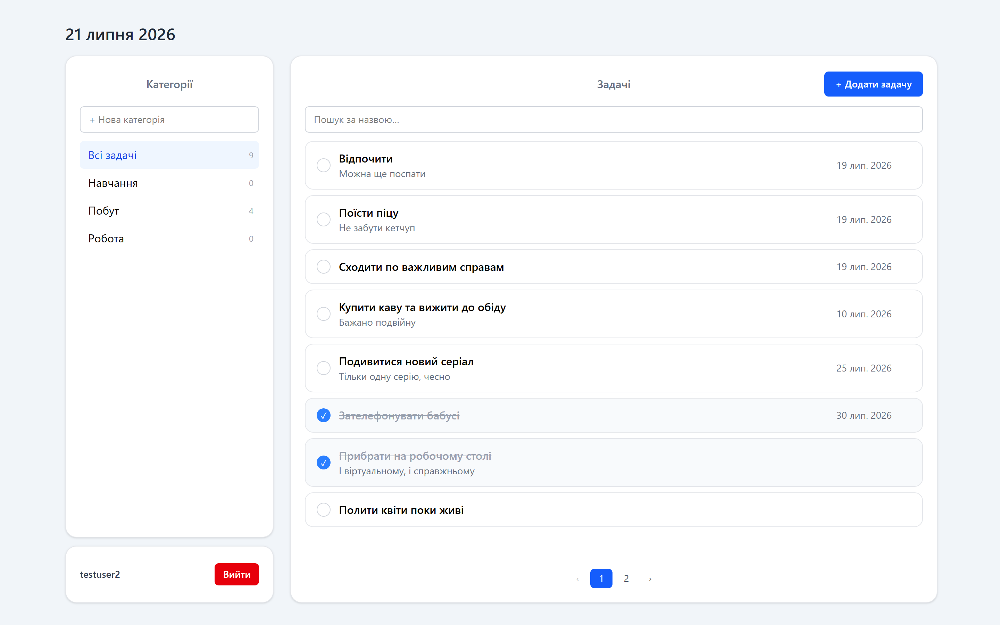

# ToDo App — Angular + .NET Core

A to-do application with categories, search and pagination.
Test task (Trainee/Junior): Angular SPA + ASP.NET Core REST API, EF Core, JWT auth, 4-layer architecture.



## Tech stack

**Backend:** .NET 8, ASP.NET Core Web API, EF Core, SQL Server Express, JWT (Bearer), BCrypt, Swagger
**Frontend:** Angular 19 (standalone components), TypeScript, Tailwind CSS v4, RxJS, Reactive Forms

## Features

- **Auth** — registration and login, JWT stored in `localStorage`; protected routes; automatic redirect to login on `401`
- **Tasks** — create, edit, delete, mark as done/undone; title, description, due date, category
- **Categories** — create, rename, delete; deleting a category keeps its tasks (they become uncategorized)
- **Filtering** — by category, with task counts in the sidebar
- **Search** — by task title, server-side, with debounce
- **Pagination** — server-side
- **Data isolation** — every user only sees their own tasks and categories
- **Validation** — on both sides: Angular Reactive Forms (UX) and data annotations on request DTOs (security)

UI language: Ukrainian.

## Project structure

```
backend/
  ToDoApp.Api/          controllers, Program.cs, appsettings
  ToDoApp.Services/     business logic, JWT, auth
  ToDoApp.DataAccess/   EF Core: DbContext, repositories, migrations
  ToDoApp.Domain/       entities and DTOs
frontend/
  src/app/core/         models, services, guards, interceptors
  src/app/features/     screens: auth (login, register), tasks
```

Dependency flow: `Api → Services → DataAccess → Domain`.

## Requirements

- .NET 8 SDK
- Node.js 18+ and npm
- SQL Server Express (or any SQL Server instance)

## Getting started

### 1. Backend

```bash
cd backend
```

Set the JWT signing key (kept out of git via user-secrets):

```bash
dotnet user-secrets set "Jwt:Key" "<any-long-random-string-at-least-32-chars>" --project ToDoApp.Api
```

Check the connection string in `ToDoApp.Api/appsettings.json` and adjust the server name if your SQL Server instance differs:

```json
"DefaultConnection": "Server=.\\SQLEXPRESS;Database=ToDoAppDb;Trusted_Connection=True;TrustServerCertificate=True;"
```

Create the database and run the API:

```bash
dotnet ef database update --project ToDoApp.DataAccess --startup-project ToDoApp.Api
dotnet run --project ToDoApp.Api
```

API runs at `http://localhost:5110`, Swagger UI at `http://localhost:5110/swagger`.

### 2. Frontend

In a second terminal:

```bash
cd frontend
npm install
npm start
```

App runs at `http://localhost:4200`. Open it and register a new account.

> The API address is configured in `frontend/src/environments/environment.ts`.

## API endpoints

All endpoints except `/api/auth/*` require an `Authorization: Bearer <token>` header.

| Method | Endpoint                                         | Description               |
|--------|--------------------------------------------------|---------------------------|
| POST   | `/api/auth/register`                             | register, returns a token |
| POST   | `/api/auth/login`                                | log in, returns a token   |
| GET    | `/api/tasks?page=&pageSize=&search=&categoryId=` | paged list of tasks       |
| GET    | `/api/tasks/{id}`                                | single task               |
| POST   | `/api/tasks`                                     | create a task             |
| PUT    | `/api/tasks/{id}`                                | update a task             |
| DELETE | `/api/tasks/{id}`                                | delete a task             |
| GET    | `/api/categories`                                | list categories           |
| POST   | `/api/categories`                                | create a category         |
| PUT    | `/api/categories/{id}`                           | rename a category         |
| DELETE | `/api/categories/{id}`                           | delete a category         |

## Notes

- Passwords are stored as BCrypt hashes, never in plain text.
- The JWT lifetime is set in `appsettings.json` (`Jwt:ExpiryMinutes`, currently 24 hours).
- `Jwt:Key` is intentionally not committed — set it via user-secrets as shown above.
